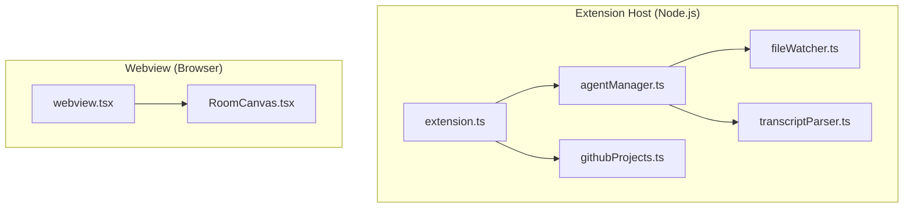
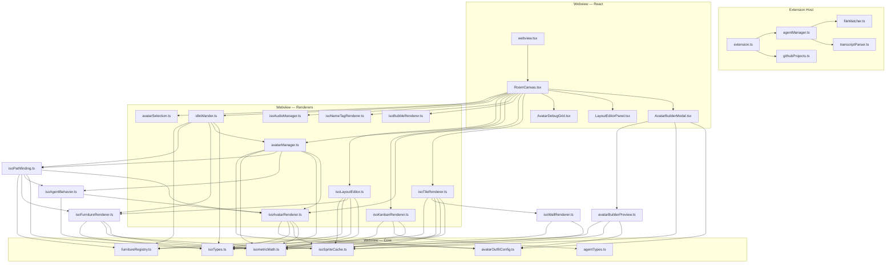

# Phase 18: Architecture Documentation Lite — Research

**Researched:** 2026-03-08
**Domain:** Codebase documentation, architecture diagrams, Mermaid
**Confidence:** HIGH

## Summary

Phase 18 is a documentation-only phase that produces human-readable architecture diagrams and module documentation for the current codebase state. The project has 32 source files (~8,400 lines) across a VS Code extension with an isometric Canvas 2D renderer, agent state management, and asset pipeline. No code changes are needed — only Markdown files with embedded Mermaid diagrams that link back to source file paths.

The codebase has clear architectural layers (extension host / webview / shared types) but no documentation describing them. Phase 19 depends on this phase for planning a refactor, so accuracy and completeness are critical. The diagrams should be machine-verifiable against actual imports to prevent drift.

**Primary recommendation:** Use Mermaid diagrams embedded in Markdown files, organized by architectural concern (module graph, data flow, render pipeline, extension lifecycle). Each diagram node should reference the source file path. No external tooling needed — Mermaid renders natively in GitHub and VS Code.

## Standard Stack

### Core
| Library | Version | Purpose | Why Standard |
|---------|---------|---------|--------------|
| Mermaid | N/A (Markdown-embedded) | Architecture diagrams | Renders in GitHub, VS Code, and most Markdown viewers natively; no build step |
| Markdown | N/A | Documentation format | Already used throughout `.planning/`; zero friction |

### Supporting
| Library | Version | Purpose | When to Use |
|---------|---------|---------|-------------|
| None | — | — | No additional tooling needed |

### Alternatives Considered
| Instead of | Could Use | Tradeoff |
|------------|-----------|----------|
| Mermaid in Markdown | D2 / PlantUML | Requires external renderer; Mermaid is built into GitHub/VS Code |
| Mermaid in Markdown | draw.io / Excalidraw | Binary/JSON files that can't be diffed; manual maintenance |
| Manual diagrams | madge / dependency-cruiser | Auto-generated but produces noisy graphs for 32 files; manual curation is better for human review |

**Installation:**
```bash
# No installation needed — Mermaid renders in GitHub and VS Code natively
```

## Architecture Patterns

### Current Codebase Structure (as-is)
```
src/
├── extension.ts              # VS Code extension host entry (293 lines)
├── webview.tsx                # Webview React entry (186 lines)
├── RoomCanvas.tsx             # Main React component + rAF loop (909 lines)
├── AvatarBuilderModal.tsx     # Avatar customization UI (519 lines)
├── AvatarDebugGrid.tsx        # Debug visualization (175 lines)
├── LayoutEditorPanel.tsx      # Layout editor React panel (247 lines)
│
├── isometricMath.ts           # Pure math: tileToScreen, screenToTile, getDirection (94 lines)
├── isoTypes.ts                # Core types: TileGrid, Renderable, HsbColor, depthSort (169 lines)
├── isoSpriteCache.ts          # Asset loading: NitroAssetData, loadNitroAsset, getNitroFrame (239 lines)
├── isoTileRenderer.ts         # Floor/room pre-render to OffscreenCanvas (357 lines)
├── isoWallRenderer.ts         # Wall panel drawing (143 lines)
├── isoFurnitureRenderer.ts    # Furniture sprite rendering + chair splitting (712 lines)
├── isoAvatarRenderer.ts       # 13-layer avatar composition + walk/blink animation (787 lines)
├── isoBubbleRenderer.ts       # Speech bubble drawing (122 lines)
├── isoNameTagRenderer.ts      # Name tag drawing (75 lines)
├── isoKanbanRenderer.ts       # Kanban sticky notes on walls (639 lines)
├── isoAgentBehavior.ts        # Path-to-screen conversion, parent-child lines (158 lines)
├── isoPathfinding.ts          # BFS pathfinding on tile grid (171 lines)
├── isoLayoutEditor.ts         # Mouse-to-tile editing logic (349 lines)
├── isoAudioManager.ts         # Audio playback with silent fallback (110 lines)
│
├── agentManager.ts            # JSONL file watching + agent state machine (247 lines)
├── agentTypes.ts              # Shared types: AgentState, AgentEvent, messages (51 lines)
├── avatarManager.ts           # Avatar lifecycle: spawn, move, sit, outfit (328 lines)
├── avatarOutfitConfig.ts      # Outfit catalog, palettes, presets (271 lines)
├── avatarSelection.ts         # Click-to-select avatar (28 lines)
├── avatarBuilderPreview.ts    # Standalone preview renderer (182 lines)
├── fileWatcher.ts             # Generic JSONL file watcher (110 lines)
├── transcriptParser.ts        # JSONL line parser (107 lines)
├── furnitureRegistry.ts       # Furniture catalog + dimension lookup (176 lines)
├── githubProjects.ts          # GitHub Projects v2 kanban fetch via gh CLI (146 lines)
├── idleWander.ts              # Random walk behavior for idle agents (236 lines)
└── global.d.ts                # Module declarations (21 lines)

scripts/
├── download-habbo-assets.mjs  # Fetch cortex-assets from GitHub
├── convert-cortex-to-nitro.mjs # Convert cortex JSON to Nitro schema
├── convert-audio-to-ogg.sh    # FFmpeg audio conversion
├── generate-avatar-placeholders.sh
├── generate-placeholder-sprites.mjs
├── generate-placeholders.sh
├── check-spritesheet-stray-pixels.mjs
└── fix-spritesheet-bleed.mjs

tests/
├── setup.ts                   # Test environment setup (happy-dom mocks)
└── 20 test files              # ~325 tests passing (Vitest)
```

### Pattern 1: Layered Module Dependency Diagram
**What:** A Mermaid flowchart showing which modules import from which, grouped by architectural layer
**When to use:** Top-level "map of the codebase" diagram
**Example:**


### Pattern 2: Data Flow Diagram
**What:** Shows how data moves from JSONL files through the extension host to the webview renderer
**When to use:** Understanding the event pipeline

### Pattern 3: Render Pipeline Diagram
**What:** Shows the rAF loop drawing order: OffscreenCanvas blit -> depth-sorted renderables -> overlays
**When to use:** Understanding draw order and the Renderable abstraction

### Pattern 4: Asset Pipeline Diagram
**What:** Shows cortex-assets -> conversion scripts -> Nitro JSON -> SpriteCache -> renderers
**When to use:** Understanding how sprites get from GitHub to the canvas

### Anti-Patterns to Avoid
- **Auto-generated-only diagrams:** Tools like madge produce complete but unreadable graphs for 32+ files. Curate manually.
- **Diagrams without file paths:** Every box/node must reference the actual source file path so a human can navigate to it.
- **Single monolithic diagram:** Split into 4-5 focused diagrams by concern, not one massive graph.
- **Documenting aspirational architecture:** Document what IS, not what SHOULD BE. Phase 19 handles the refactor.

## Don't Hand-Roll

| Problem | Don't Build | Use Instead | Why |
|---------|-------------|-------------|-----|
| Diagram rendering | Custom SVG generator | Mermaid in Markdown | Native GitHub/VS Code support, widely understood syntax |
| Import graph extraction | Manual import tracing | Read actual `import` statements from source | Accuracy over guessing; 32 files is small enough to trace manually |
| Module metrics | Custom LOC counter | `wc -l` output already captured | Simple, accurate, no tooling overhead |

**Key insight:** This is a 32-file, 8,400-line codebase. Automated architecture extraction tools are overkill and produce noisy output. Manual curation with Mermaid produces far more useful diagrams for human review.

## Common Pitfalls

### Pitfall 1: Documenting Aspirational Architecture Instead of Actual
**What goes wrong:** Diagrams show how the code "should" be organized, not how it actually is
**Why it happens:** Natural tendency to clean up during documentation
**How to avoid:** Verify every diagram edge against actual `import` statements; document warts and coupling honestly
**Warning signs:** Diagram looks cleaner than the actual import graph

### Pitfall 2: Diagram Drift from Code
**What goes wrong:** Diagrams become stale as code changes in future phases
**Why it happens:** No automated verification that diagrams match imports
**How to avoid:** Include a "Verified against" date; Phase 19 refactor will produce updated diagrams as part of its deliverable
**Warning signs:** Diagrams reference files or imports that no longer exist

### Pitfall 3: Too Much Detail
**What goes wrong:** Diagrams include every function and type, becoming unreadable
**Why it happens:** Completeness bias
**How to avoid:** Module-level granularity only (file-to-file dependencies); function-level detail goes in prose, not diagrams
**Warning signs:** Diagram has more than ~25 nodes or crosses beyond one screen

### Pitfall 4: Missing the Extension Host / Webview Boundary
**What goes wrong:** Treating the codebase as a single runtime when it actually runs in two separate contexts (Node.js extension host + browser webview)
**Why it happens:** All files are in one `src/` directory
**How to avoid:** Explicitly show the postMessage boundary between extension.ts and webview.tsx in diagrams
**Warning signs:** Diagram shows direct imports crossing the host/webview boundary

## Code Examples

### Mermaid Module Dependency Diagram


### Recommended Documentation Structure
```markdown
# Architecture — habbo-pixel-agents

## 1. System Overview
[High-level diagram: Extension Host <-> postMessage <-> Webview]

## 2. Module Dependency Graph
[Full import graph with file paths]

## 3. Render Pipeline
[rAF loop: OffscreenCanvas blit -> depth sort -> draw renderables -> overlays]

## 4. Data Flow: Agent Events
[JSONL -> fileWatcher -> transcriptParser -> agentManager -> postMessage -> RoomCanvas -> avatarManager]

## 5. Asset Pipeline
[cortex-assets -> download script -> convert script -> Nitro JSON -> SpriteCache -> renderers]

## 6. Module Index
[Table: file | purpose | lines | key exports | imported by]
```

## State of the Art

| Old Approach | Current Approach | When Changed | Impact |
|--------------|------------------|--------------|--------|
| README.md only | Mermaid in Markdown | 2023+ | GitHub renders Mermaid natively since Feb 2022 |
| External diagram tools | Code-embedded Mermaid | 2024+ | Diagrams live next to code, version-controlled |
| Auto-generated dependency graphs | Curated architecture docs | Ongoing | Better signal-to-noise for human review |

## Open Questions

1. **Where should the documentation live?**
   - What we know: `.planning/` is for GSD workflow docs; `src/` is for code
   - What's unclear: Should architecture docs go in `.planning/phases/18-*/` (phase artifact) or a top-level `docs/` or `ARCHITECTURE.md`?
   - Recommendation: Create a top-level `ARCHITECTURE.md` as the deliverable, since it needs to outlive the phase and be findable. Phase 18 directory holds plans/research only.

2. **Should diagrams be verified programmatically?**
   - What we know: 32 files is small enough to trace manually; import graph changes rarely
   - What's unclear: Whether a simple script to extract imports and compare to diagram edges is worth the effort
   - Recommendation: Skip automated verification for "lite" — Phase 19 can add it if the refactor changes many imports

3. **How much prose vs. diagrams?**
   - What we know: This is "lite" documentation, not comprehensive (that's Phase 19)
   - Recommendation: ~60% diagrams, ~40% annotated prose. Enough for a human to orient themselves in the codebase in 10 minutes.

## Validation Architecture

### Test Framework
| Property | Value |
|----------|-------|
| Framework | Vitest 1.x |
| Config file | vitest.config.ts |
| Quick run command | `npx vitest run` |
| Full suite command | `npx vitest run` |

### Phase Requirements -> Test Map
| Req ID | Behavior | Test Type | Automated Command | File Exists? |
|--------|----------|-----------|-------------------|-------------|
| N/A | Documentation accuracy vs imports | manual-only | Verify diagram edges match `grep "^import" src/*.ts` | N/A |

This is a documentation-only phase. No functional code changes, so no automated tests needed. Validation is manual review of diagram accuracy against actual source imports.

### Sampling Rate
- **Per task commit:** Manual review — do diagram edges match actual imports?
- **Per wave merge:** `npx vitest run` (ensure no code was accidentally changed)
- **Phase gate:** Human review confirms diagrams are accurate and complete

### Wave 0 Gaps
None — no test infrastructure needed for documentation-only phase.

## Sources

### Primary (HIGH confidence)
- Codebase analysis: Direct inspection of all 32 source files, import statements, and export signatures
- GitHub Mermaid support: Verified native rendering since February 2022

### Secondary (MEDIUM confidence)
- Mermaid syntax: Based on training data knowledge of Mermaid diagram types (graph, flowchart, sequenceDiagram, classDiagram)

## Metadata

**Confidence breakdown:**
- Standard stack: HIGH — Mermaid in Markdown is the obvious choice; no alternatives needed
- Architecture: HIGH — Direct codebase inspection; all imports traced from source
- Pitfalls: HIGH — Common documentation anti-patterns well-understood

**Research date:** 2026-03-08
**Valid until:** 2026-04-08 (stable — documentation tooling changes slowly)