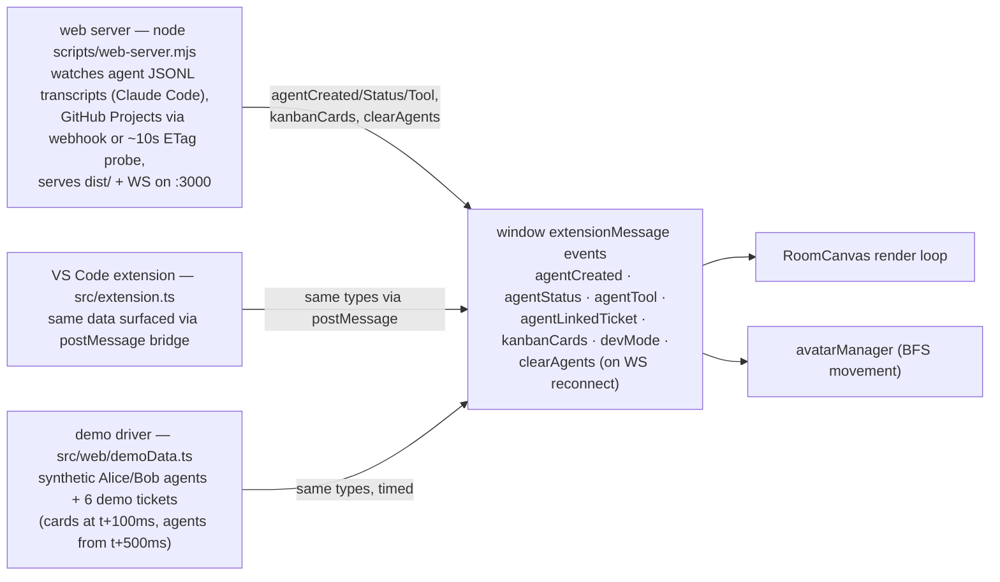
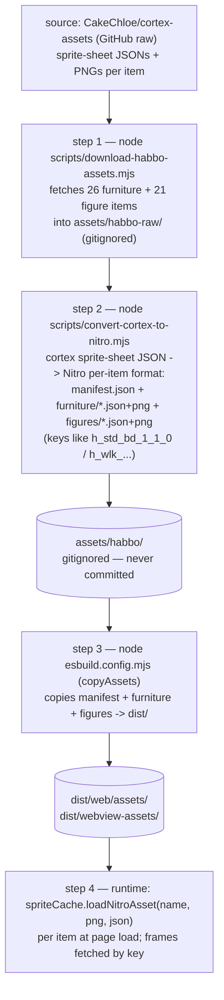
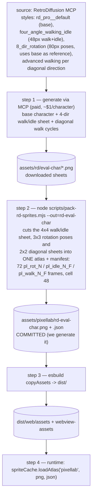

# Habbo Pixel Agents

Visualize AI coding agent activity as animated Habbo Hotel–style avatars in an isometric pixel-art room. Agents appear as characters who walk, sit, and talk — with speech bubbles showing live tool calls, name tags displaying status, and wall sticky notes pulled from your project board.

.png>)

## Why?

Agent work disappears into logs, terminals, PRs, and board state. Teams see outcomes but not the live flow of _who is doing what_. This project treats developer orchestration as something worth visualizing — using a form people instantly understand.

## Features

- 🏨 **Isometric Habbo room** — Canvas 2D renderer with tiles, walls, furniture, and depth sorting
- 🤖 **Live agent avatars** — GitHub Copilot coding agents appear as animated characters in real time
- 💬 **Speech bubbles** — each agent's current tool call or status shown as a floating bubble
- 🏷️ **Name tags** — agent names with colored status dots (active / idle)
- 📋 **Wall kanban notes** — sticky notes synced from **GitHub Projects** or **Azure DevOps Boards**
- 🔗 **Agent ↔ ticket linking** — see which agent is working on which board item
- 🪑 **Furnished rooms** — decorative and functional furniture with the classic Habbo aesthetic
- 🎨 **Room editor** — rearrange furniture, change wall/floor colors
- 📡 **Multiple feed modes** — SSE, fast-poll, and standard poll for Copilot session monitoring

## Use Cases

| Scenario                      | How it helps                                                                                                           |
| ----------------------------- | ---------------------------------------------------------------------------------------------------------------------- |
| **Monitoring Copilot agents** | See all active Copilot coding agent sessions at a glance — who's running, what they're doing, which PRs they've opened |
| **Sprint standups**           | Project the room on a screen during standups — board items and agent activity in one visual                            |
| **Solo development**          | Keep the room open in a browser tab as a live dashboard while you delegate work to Copilot agents                      |
| **Team awareness**            | Multiple agents working in parallel become tangible characters rather than hidden background processes                 |
| **Demo & presentation**       | Show stakeholders how AI agents interact with your project in a fun, intuitive way                                     |

## Getting Started

### Prerequisites

- **Node.js 22+** (see `.nvmrc`)
- **npm 7+** (workspaces support)
- A **GitHub Personal Access Token** with `repo` and `actions` read scopes (for Copilot agent monitoring)

### 1. Clone and install

```bash
git clone https://github.com/AventusM/habbo-pixel-agents.git
cd habbo-pixel-agents
npm install
```

### 2. Configure environment

Run the interactive setup wizard:

```bash
npm run configure
```

This walks you through setting up:

- **GitHub repository** to monitor (`owner/repo`)
- **GitHub token** for API access
- **Kanban source** — GitHub Projects or Azure DevOps
- **Server port** (default: 3000)

The wizard writes a `.env` file. You can also copy `.env.example` and fill it in manually:

```bash
cp .env.example .env
# Edit .env with your values
```

<details>
<summary>Environment variables reference</summary>

| Variable                    | Required | Description                                      |
| --------------------------- | -------- | ------------------------------------------------ |
| `GITHUB_REPO`               | Yes      | Repository to monitor (`owner/repo`)             |
| `GITHUB_TOKEN`              | Yes      | GitHub PAT with `repo` and `actions` read scopes |
| `GITHUB_POLL_INTERVAL`      | No       | Polling interval in seconds (default: `15`)      |
| `KANBAN_SOURCE`             | No       | `github` or `azuredevops` (default: `github`)    |
| `GITHUB_PROJECT_OWNER`      | No       | GitHub org/user for Projects v2 kanban           |
| `GITHUB_PROJECT_OWNER_TYPE` | No       | `org` or `user`                                  |
| `GITHUB_PROJECT_NUMBER`     | No       | Project number from the project URL              |
| `GITHUB_PROJECT_POLL_INTERVAL` | No    | Legacy full-poll seconds (default: `60`)         |
| `WEBHOOK_SECRET`            | Hosted   | Enables webhook delivery + HMAC validation       |
| `BOARD_PROBE_INTERVAL`      | No       | ETag probe interval in seconds (default: `10`)   |
| `WEBHOOK_DEBOUNCE_MS`       | No       | Webhook debounce window (default: `300`)         |
| `AZDO_ORG`                  | No       | Azure DevOps organization name                   |
| `AZDO_PROJECT`              | No       | Azure DevOps project name                        |
| `AZDO_PAT`                  | No       | Azure DevOps Personal Access Token               |
| `AZDO_POLL_INTERVAL`        | No       | ADO polling interval in seconds (default: `60`)  |
| `PORT`                      | No       | Web server port (default: `3000`)                |

</details>

### 3. Build

```bash
npm run build
```

This compiles both the VS Code extension and the web client using esbuild.

### 4. Run

There are two ways to use Habbo Pixel Agents:

#### Option A: Standalone web dashboard

Open the room in your browser — no VS Code required:

```bash
npm run dashboard
```

Or start the web server directly:

```bash
npm run web
```

Then visit **http://localhost:3000**. The dashboard connects via WebSocket and shows live agent activity. The status chip reports the active board source (`board: webhook | probe | demo`); see [Hosted deployment](docs/guides/HOSTED-DEPLOYMENT.md) for webhook setup and the public-URL recipe, or [Local wall over a Tailscale tailnet](docs/guides/LOCAL-TAILNET-ACCESS.md) to reach the wall privately from your phone (`GET /health` answers for service checks).

You can also pass arguments directly:

```bash
npx habbo-dashboard owner/repo --port 8080
```

#### Option B: VS Code extension

1. Open this repository in VS Code
2. Press **F5** (or **Run → Start Debugging**) to launch the Extension Development Host
3. In the new VS Code window, open the **Habbo Agents** panel from the Activity Bar (left sidebar)
4. Or run **"Open Habbo Room"** from the Command Palette (`Cmd+Shift+P`)

The VS Code extension includes a built-in **room editor** — you can place, rotate, and rearrange furniture directly in the room and preview the result immediately. This is the fastest way to test new furniture assets after running the pack script.

### 5. Verify it works

Once running, you should see:

- An isometric room with tiled floor and walls
- Any active Copilot coding agent sessions appearing as animated avatars
- Kanban sticky notes on the wall (if board integration is configured)

If no agents are active, the room will be empty but functional — agents appear automatically when Copilot sessions start.

## VS Code Commands

| Command                             | Description                                  |
| ----------------------------------- | -------------------------------------------- |
| **Open Habbo Room**                 | Open the isometric room view                 |
| **Habbo: Configure Integration**    | Interactive setup for GitHub/ADO credentials |
| **Habbo Debug: Spawn Agent**        | Spawn a test agent (development)             |
| **Habbo Debug: Despawn Last Agent** | Remove the last test agent (development)     |

## Configuration (VS Code Settings)

These settings can be configured in VS Code's Settings UI under **Habbo Pixel Agents**:

| Setting                                              | Default  | Description                                     |
| ---------------------------------------------------- | -------- | ----------------------------------------------- |
| `habboPixelAgents.kanbanSource`                      | `github` | Kanban board source (`github` or `azuredevops`) |
| `habboPixelAgents.githubProject.owner`               | —        | GitHub org/user for Projects kanban             |
| `habboPixelAgents.githubProject.ownerType`           | `org`    | `org` or `user`                                 |
| `habboPixelAgents.githubProject.projectNumber`       | `0`      | GitHub Projects project number                  |
| `habboPixelAgents.githubProject.pollIntervalSeconds` | `60`     | Kanban refresh interval                         |
| `habboPixelAgents.azureDevOps.organization`          | —        | Azure DevOps organization                       |
| `habboPixelAgents.azureDevOps.project`               | —        | Azure DevOps project                            |
| `habboPixelAgents.azureDevOps.pat`                   | —        | Azure DevOps PAT (store in user settings only)  |
| `habboPixelAgents.azureDevOps.pollIntervalSeconds`   | `60`     | ADO refresh interval                            |

> **Tip:** Environment variables take priority over VS Code settings. Use `.env` for the web dashboard and VS Code settings for the extension.

## Project Structure

```
habbo-pixel-agents/
├── src/                      # Extension + webview TypeScript source
│   ├── extension.ts          # VS Code extension entry point
│   ├── webview.tsx           # Room webview (React 19 + Canvas 2D)
│   ├── agentManager.ts       # Agent lifecycle and state machine
│   ├── roomLayoutEngine.ts   # Room layout generation
│   ├── isoTileRenderer.ts    # Main rendering orchestrator
│   ├── isoFurnitureRenderer.ts
│   ├── isoAvatarRenderer.ts  # 11-layer Habbo avatar composition
│   ├── isoBubbleRenderer.ts  # Speech bubbles
│   ├── isoKanbanRenderer.ts  # Wall sticky notes
│   └── web/                  # Standalone web client
├── packages/
│   └── agent-dashboard/      # Standalone Node.js dashboard package
├── assets/
│   ├── habbo/furniture/      # Nitro-format furniture sprites
│   ├── habbo/figures/        # Nitro-format avatar sprites
│   └── pixellab/furniture/   # PixelLab source PNGs
├── scripts/                  # Build tools, asset pipeline, web server
├── tests/                    # Vitest test files
├── docs/                     # Guides, slides, images
└── dist/                     # Build output
```

## Kanban Board Integration

### GitHub Projects

1. Create a [GitHub Projects v2](https://docs.github.com/en/issues/planning-and-tracking-with-projects) board
2. Set `KANBAN_SOURCE=github` in `.env`
3. Configure `GITHUB_PROJECT_OWNER`, `GITHUB_PROJECT_OWNER_TYPE`, and `GITHUB_PROJECT_NUMBER`
4. Board items appear as sticky notes on the room wall

### Azure DevOps Boards

1. Set `KANBAN_SOURCE=azuredevops` in `.env`
2. Configure `AZDO_ORG`, `AZDO_PROJECT`, and `AZDO_PAT`
3. Work items (with child tasks and linked PRs) appear as wall sticky notes
4. When a Copilot agent opens a PR linked to a work item (via `AB#NNN`), the item automatically moves to **Doing**

See [docs/guides/COPILOT-AGENT-MONITOR.md](docs/guides/COPILOT-AGENT-MONITOR.md) for the full GitHub Actions workflow that syncs Copilot PR events with Azure DevOps board state.

## Architecture

How the system really works — module graph, data flow, render pipeline, asset
pipeline, event lifecycle, and the failure-mode inventory (each mapped to a
real incident), plus the target architecture:

**[docs/architecture/ARCHITECTURE.md](docs/architecture/ARCHITECTURE.md)**

Regenerate the module graph with `npm run arch:graph`.

### At a glance

#### 1. Who feeds the room, with what

Three hosts converge on one event bus. The room itself only understands
`extensionMessage` window events (typed union in `src/agentTypes.ts`) — hosts
are aggregation adapters.



#### 2. What the render loop does per frame

`RoomCanvas.frame()` runs at rAF. Ticks update agent positions/animation
state; a throttle gate (Q13) skips the expensive draw pass unless the camera
moved or an agent is walking/spawning. The draw pass blits two **cached
world-space layers** and draws dynamic elements live.

| Step | What happens | Where |
|---|---|---|
| tick — paths | `avatarManager.tick`: BFS pathfinding; agents step one tile per ~350ms, direction from `getDirection` (Habbo 0–7 clockwise from NE) | `src/avatarManager.ts` |
| tick — wander | idle agents pick random nearby walk targets per section | `src/idleWander.ts` |
| tick — effects | teleport spawn/despawn effects, booth door open/close | `src/teleportEffect.ts` |
| gate | render immediately if camera moved or any agent walks/spawns; else at most every 50ms | `src/RoomCanvas.tsx` |
| draw 1 | **room layer blit** (visible slice, 1:1): floor rhombuses + section colors + walls, pre-rendered once by `preRenderRoom()` into a buffer sized to the room's extent | `src/isoTileRenderer.ts` |
| draw 2 | **kanban notes layer blit**: 60+ wall stickies + Todo/Done aggregates, re-rendered into a cache only when cards/filter/expand change | `src/isoKanbanRenderer.ts` |
| draw 3 | live furniture renderables (sprite frames, multi-tile support) | `src/isoFurnitureRenderer.ts` |
| draw 4 | avatars: `habboRenderer` (13-layer Nitro parts, tint-cached) when figure assets are loaded locally — else `pixelLabRenderer` (single sprites from the RD/PixelLab atlas) | `src/isoAvatarRenderer.ts`, `src/pixelLabAvatarRenderer.ts` |
| draw 5 | selection highlight, teleport FX, speech bubbles, name tags | `src/RoomCanvas.tsx` |
| draw 6 | screen-space: expanded note detail, aggregate list, orchestration HUD, kanban filter chip | `src/isoKanbanRenderer.ts`, `src/isoOrchestrationOverlay.ts` |

#### 3. Where the art comes from — step by step

Two independent pipelines produce the sprites; both end in the same runtime
cache (`SpriteCache`) that renderers read frames from.

**Pipeline A — original Habbo assets** (furniture + figures; furniture is
committed, figures are local-only/CI-time — see copyright posture in
[docs/architecture/ARCHITECTURE.md](docs/architecture/ARCHITECTURE.md)):



**Pipeline B — generated characters** (RetroDiffusion; PixelLab archived):



The manifest contract (`pl_*` keys, Texture-Packer JSON) is the single point
where generated art meets the renderer — the same keys the original Habbo
figure renderer maps for Nitro parts (`h_std_*`/`h_wlk_*`).

#### 4. Module clusters (generated — 50 modules, `npm run arch:graph`)

| Cluster | Responsibility | Notable members |
|---|---|---|
| ui-react | React shells over the canvas | `RoomCanvas.tsx` (1,882 lines — S03 extraction target) |
| room-engine | isometric rendering + sim helpers | `isoTile/Wall/Furniture/Kanban/NameTag/Bubble/OrchestrationOverlay`, `cameraController`, `idleWander` |
| avatars | figure + sprite avatar backends | `isoAvatarRenderer`, `pixelLabAvatarRenderer`, `avatarManager`, `avatarOutfitConfig` |
| agents | agent discovery/lifecycle | `agentManager`, `agentClassifier` |
| kanban | card source + text helpers | `githubProjects`, `azureDevOpsBoards`, `kanbanText`, `kanbanFilter` |
| integrations | external data fetchers | `githubProjects`, `azureDevOpsBoards`, `copilotMonitor` |
| web-host / hosts | standalone web + extension entry | `main.tsx`, `webview.tsx`, `wsClient`, `demoData` |
| env | config plumbing | `envConfig`, `global.d.ts` |

```mermaid
graph LR;
  "agents"["agents"];
  "avatars"["avatars"];
  "core-misc"["core-misc"];
  "env"["env"];
  "hosts"["hosts"];
  "integrations"["integrations"];
  "kanban"["kanban"];
  "room-engine"["room-engine"];
  "ui-react"["ui-react"];
  "web-host"["web-host"];
  "agents"  -->  "core-misc";
  "agents"  -->  "integrations";
  "avatars"  -->|3|  "agents";
  "avatars"  -->|9|  "room-engine";
  "core-misc"  -->|4|  "agents";
  "core-misc"  -->  "env";
  "core-misc"  -->|2|  "integrations";
  "core-misc"  -->  "room-engine";
  "hosts"  -->|4|  "room-engine";
  "hosts"  -->|3|  "ui-react";
  "hosts"  -->|2|  "web-host";
  "integrations"  -->|3|  "agents";
  "integrations"  -->  "kanban";
  "kanban"  -->  "agents";
  "room-engine"  -->|5|  "agents";
  "room-engine"  -->|5|  "avatars";
  "room-engine"  -->  "kanban";
  "ui-react"  -->  "agents";
  "ui-react"  -->|4|  "avatars";
  "ui-react"  -->  "kanban";
  "ui-react"  -->|25|  "room-engine";
  "web-host"  -->|3|  "agents";
  "web-host"  -->|3|  "integrations";
```

## Development

### Build and test

```bash
# Build everything
npm run build

# Run tests
npm test

# Type-check
npx tsc --noEmit

# Watch mode (tests)
npm run test:watch
```

### Adding furniture

The project includes a PixelLab asset pipeline for converting PNG sprites into Habbo-compatible furniture:

```bash
# Pack a PixelLab PNG into a Nitro spritesheet
node scripts/pack-pixellab-furniture.mjs assets/pixellab/furniture/my-desk.png my_desk

# Options: --bottom-offset=N, --dimensions=WxHxD, --directions=0,2,4,6
```

Then register the item in `src/furnitureRegistry.ts` and rebuild.

## Tech Stack

- **TypeScript** — strict mode, ESM-first
- **React 19** — webview UI
- **Canvas 2D** — isometric rendering (no WebGL dependency)
- **esbuild** — fast bundling (extension + webview + web targets)
- **Vitest** — testing
- **WebSocket** — real-time agent event relay (web dashboard)
- **Node.js 22** — server and build tooling

## License

MIT — see [LICENSE](LICENSE) for details.
