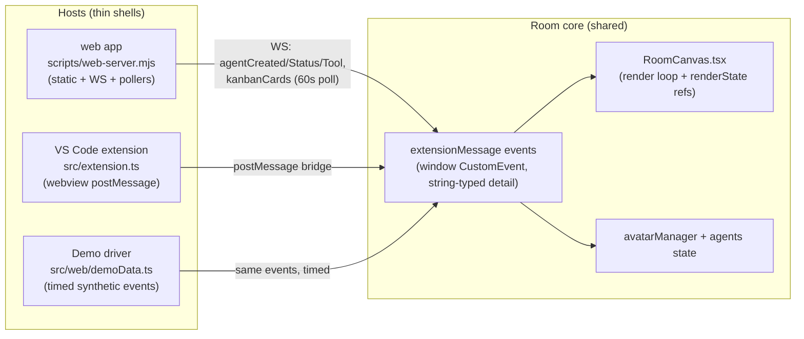
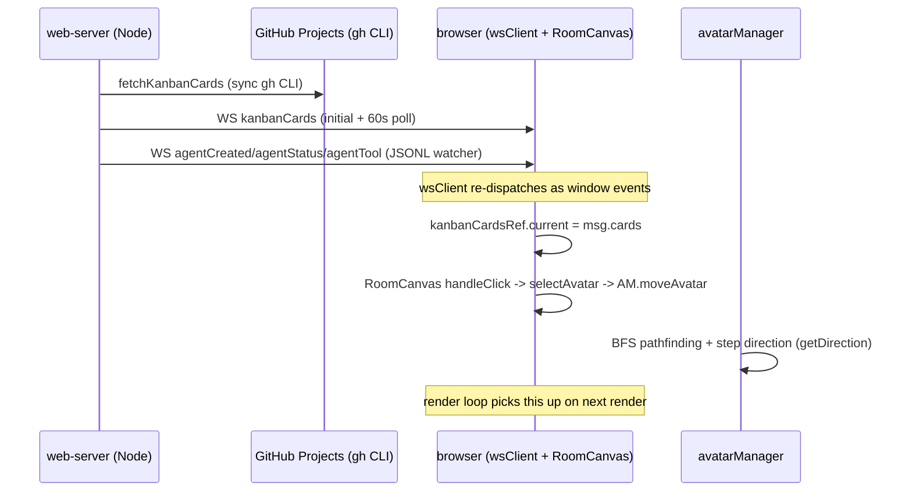
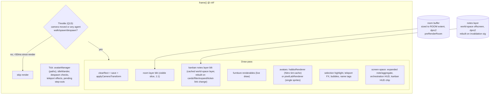
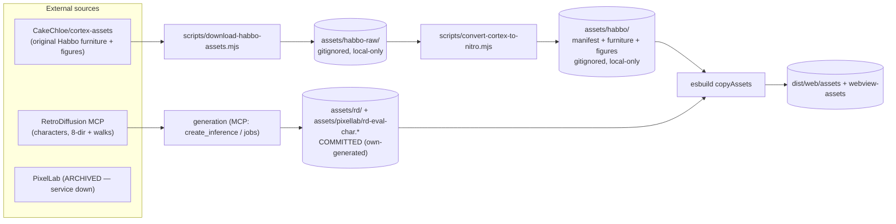
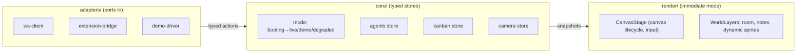

# Architecture — how this system really works (2026-09)

> Honest current state, not aspiration. Every claim is traceable to an incident
> or a code location. Target state at the bottom. Regenerate the module graph
> with `npm run arch:graph` (output: [module-graph.md](./module-graph.md)).

## 1. System overview — three hosts, one room

The room is a **canvas-based isometric visualization** fed by **external state**
(AI agents working in a repo + kanban tickets). Three host shells mount the
same room; a Node sidecar aggregates external data.

Key fact: **the WS server and the extension are aggregation adapters** — the
room itself only understands `extensionMessage` window events
(`ExtensionMessage` union in `src/agentTypes.ts`).

## 2. Runtime data flow (live agents + tickets)

Timing-sensitive spots (marked ⚠ in the code review):

- **Demo cards were lost pre-listener** — `scheduleDemoEvents` dispatched
  synchronously after `createRoot().render()`; React effects attach listeners
  after paint. Fixed with a 100ms timer (Q13b); S02 replaces this with a
  startup replay guarantee.
- **WS reconnect** dispatches `clearAgents` — server re-sends current sessions;
  agents are cleared then repopulated (order-sensitive).
- **Demo fallback** starts after 5s without real agents; `?demo` forces it.
  There is no explicit mode state machine yet (S04 target).

## 3. Render pipeline (per frame)

Layers and caches (the Q12/Q13 pattern that S03 formalizes):

| Layer | Storage | Invalidation signature |
|---|---|---|
| Room (floor+walls) | offscreen buffer, room-extent sized | grid/tile colors/furniture layout changes (`reRenderRoom`) |
| Kanban notes | offscreen layer | cards ids · filter · expanded ids · linked tickets · origin |
| Nitro figure sprites | tinted-sprite WeakMap cache | (frame, color, flip) — composite runs once per variant |
| Camera | mutable `CameraState` | none (pan/zoom are immediate; render throttled separately) |

## 4. Asset pipeline

Copyright posture (D001-era, PR #66): original Habbo **figures are never
committed** — downloaded at CI time for the Pages deployment, locally via the
scripts for dev. PixelLab/RD output we generate ourselves and commit freely.

Avatar renderer selection: `habboRenderer.isAvailable(spriteCache)` when the
figure assets loaded → original Habbo figures; else `pixelLabRenderer`
(RD/PixelLab single sprites). Logged on change.

## 5. Failure-mode inventory

| # | Symptom (real incident) | Root cause | Guard today | Residual risk |
|---|---|---|---|---|
| F1 | Walls/tiles cropped after enlarging the window (desktop, Q11 report) | `initCanvas` pinned inline CSS size; backing store never re-measured; no resize listener | initCanvas re-asserts 100% + resets transform; debounced resize re-inits + re-renders | None known |
| F2 | Only one section's floor rendered on phone; furniture floated (Q12 screenshot) | offscreen room buffer sized to *viewport*, clipping the room | buffer sized to ROOM extent; camera navigates it | Very large zoom-out shows buffer edge (pad 48px) |
| F3 | Demo tickets missing on Pages (Q13b) | `kanbanCards` dispatched synchronously before React effect listeners attached | 100ms dispatch timer | If listeners ever attach later than ~100ms; S02 replay removes the race class |
| F4 | `TILE_H is not defined` shipped silently | tsconfig included only `*.ts` — **no .tsx was ever typechecked** | include + jsx flag (Q11) | 7 pre-existing test-file errors remain as baseline |
| F5 | "Why don't I see tickets/agents?" confusion | silent-fallback pattern: 11 `return []` sites, console.warn only | none yet | S02 surfaces degraded states in the status bar |
| F6 | VS Code extension pointed at the old 104px atlas after the RD swap | duplicated loaders (main.tsx vs webview.tsx vs extension.ts) drift | fixed in M002/S03 | Drift class remains until S02 shared bootstrap |
| F7 | Zoom/pan jank (mobile + desktop) | whole-buffer transform scaling per frame + 60+ text draws + per-part tint composites at 3× DPR | Q13: slice blits, notes layer, tint cache, throttle, DPR≤2 | Walking avatars force full render rate; notes layer invalidation breadth |
| F8 | GSD planning mutations failed from opencode | GSD 1.18 assumes Claude Code `_meta` idempotency metadata | `scripts/gsd-mcp-proxy.mjs` injects replay-stable keys | Proxy must be kept in opencode.json path (it is) |

## 6. Target architecture (proposed — S02–S04 are the migration)

**Composite: hexagonal boundaries + unidirectional typed store + immediate-mode
layered renderer, organized by feature slice.**

Pattern catalogue (formalize what already works):

1. **Cache-with-invalidation-signature** — notes layer, tint cache (§3)
2. **Explicit mode state machine** — demo/live/degraded transitions (S04)
3. **Surface degradation over silent fallback** — status chip (S02)
4. **Typed message union at the bus** — no stringly-typed dispatch (the
   `clearAgents` fix is the precedent)
5. **Feature-sliced directories** — `core/ render/ adapters/ assets/
   integrations/ hosts/` (see module-graph clusters: room-engine, avatars,
   agents, kanban, integrations, ui-react, hosts already exist informally)

Rejected with rationale: **ECS** (the room visualizes external state, it does
not simulate — 5 avatars don't justify it), **Clean/Onion ceremony** (DI
containers and per-layer interfaces are heavy for this size; hexagonal gives
the boundary discipline), **event sourcing** (JSONL transcripts are already the
event log; UI state is ephemeral).

## 7. Module map

See [module-graph.md](./module-graph.md) (generated): clusters today are
`room-engine`, `avatars`, `agents`, `kanban`, `integrations`, `ui-react`,
`hosts`, `core-misc` — the S02–S04 target directories mirror these clusters.
Notable today: `RoomCanvas.tsx` (1,882 lines) is the god component holding the
render loop, canvas lifecycle, input handling, and render state; S03 extracts
`CanvasStage` + the layer pipeline from it.
