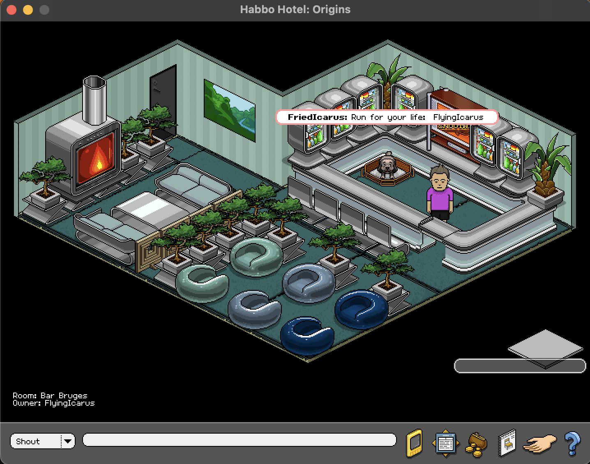

<!-- _class: lead -->

# Habbo-inspired coding agents

<!-- 
- Visualize coding agent activity as Habbo-style avatars in an isometric room
- Built with TypeScript, React 19, Canvas 2D, esbuild.
- Structured delivery via GSD-2 milestone and slice workflow.
- Copilot agents drive both the product and the development process itself.
-->
---

## My Problem

- Agent work disappears into logs, terminals, PRs, and board state.
- Devs/Teams can see outcomes, but not the live flow of who is doing what.
- This project treats developer orchestration as something worth visualizing.

> The goal is not novelty alone. The goal is operational visibility with a form people instantly understand.

---

## Habbo?

**Habbo Hotel** (2000–present) is a browser-based social game with a distinctive isometric pixel-art style.

- Millions of users built and decorated rooms with modular furniture.
- Avatars are composed from layered sprite parts.
- The aesthetic is **instantly recognizable** and inherently playful.

> This project borrows the visual language: Isometric tiles, avatars, room furniture, to make agent activity feel tangible.

---

## Show me the Habbo

- In this project, Github coding agents appear as animated Habbo-style avatars in an isometric room.
- Name tags, speech bubbles, and sticky notes expose live context.
- Room activity is driven by actual coding-session artifacts.
- Wall notes pull from **GitHub Projects** or **Azure DevOps Boards**.

> The room becomes a visual bridge between agent behavior and project management.

  .png)

---

## Demo: Azure Boards + GitHub Coding Agent

<!-- Speaker notes: 1. Configure board connection in extension settings.
2. Open the Habbo Pixel Agents panel — agents populate from the active session.
3. Wall notes sync live from the connected board.
-->

---

## Retrospective

- Weekend projects are fun again. Copilot lets a solo developer punch well above their weight. Not to mention the with the visuals.
- Structured workflows (GSD-2) begin to move the needle from art towards science.
- Next frontier: voice-driven product development. A copilot present in multi-developer calls, adding live codebase context.

---

## End*

---

## Q&A: Delivery: GSD-2 Workflow

### Shape

- Every task goes through the GSD workflow — milestones → slices → tasks.
- Copilot agents execute slices via `gsd-cli`, driven by the `pi` coding-agent harness.

### Modes

- **Step** — one unit at a time, human in the loop.
- **Auto** — research, plan, execute, commit autonomously.
- **Discuss / Status** — architecture decisions & progress dashboard.

This is a Copilot-driven project, but not an ad hoc one. Work is structured, tracked, and verifiable.

---

## Q&A: Visual assets: PixelLab

- PixelLab is an AI Pixel art generator service. Provides an MCP + easier walking animation support, which is why it was chosen over Retrodiffusion (my favourite)
- Easy to export assets and give instructions for copilot to give you the end result.